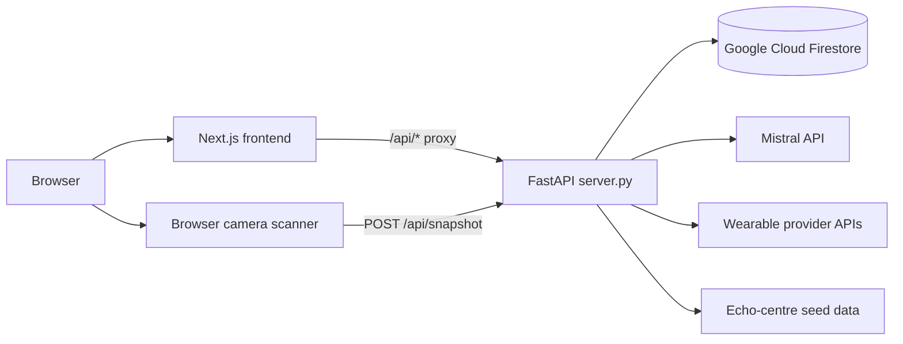

# DilSay Backend

FastAPI service for DilSay's scan persistence, patient records, cardiovascular risk reports, Mistral-generated explanations, echo-centre discovery, and wearable integrations.

This README is the backend architecture and handover reference. Read it before changing `server.py`, Firestore documents, risk inputs, or OAuth configuration. Keep it updated in the same change whenever an endpoint, collection, environment variable, or external integration changes.

> DilSay produces wellness and screening estimates, not medical diagnoses. Camera-derived vitals and risk-model output must retain appropriate user-facing disclaimers.

## Start here

For a new developer, the shortest useful reading order is:

1. This README for boundaries, flows, and operational context.
2. `server.py` for the live API and Firestore implementation.
3. `risk/router.py` and the selected risk model for health-risk behavior.
4. `wearables/registry.py`, `wearables/oauth.py`, and `wearables/adapters.py` for provider integrations.
5. The sibling frontend's `README.md` and `src/lib/api.js` for consumers of this API.

Current code is the source of truth. `storage/README.md` and `scripts/poc_core.py` describe an older MongoDB migration/proof of concept and are not the active persistence architecture.

## System context

The application is maintained as two sibling projects:

```text
dilse app/
├── backend/     # This service
└── dilse/       # Next.js frontend and in-browser camera scanner
```

The preferred production topology keeps the browser on the frontend origin. Next.js proxies `/api/*` to this FastAPI service, so ordinary browser requests remain same-origin.



The backend is stateless apart from cached process objects such as the lazy Firestore client. Durable state belongs in Firestore. A restart must not lose user data or invalidate production OAuth state when a stable `WEARABLE_STATE_SECRET` is configured.

## Responsibilities and boundaries

The backend owns:

- API contracts under `/api`
- Firestore reads, writes, queries, and deletion
- Patient record creation and administrative data access
- Server-side cardiovascular risk-model selection/calculation
- Mistral calls and narrative/report caching
- OAuth authorization-code exchange, refresh, token storage, and wearable sync
- Validation/normalization of mirrored wearable readings
- Echo-centre seed lookup
- CORS and selected admin-route protection

The backend does not own:

- Camera capture or live face/finger signal extraction; those run in the browser
- User-interface routing or local browser state
- Real user login/session authentication—the current MVP has none
- Native Apple HealthKit or Android Health Connect access
- Trained ML inference; files in `models/` are architecture-only scaffolding

## Technology stack

| Area | Technology | Notes |
|---|---|---|
| API | FastAPI, Starlette, Uvicorn | Async request handling and Swagger/OpenAPI |
| Persistence | Google Cloud Firestore async client | Active database implementation |
| External HTTP | HTTPX | Mistral, OAuth, and provider API calls |
| Configuration | `python-dotenv`, environment variables | Loads `.env` beside `server.py` for local work |
| Signal helpers | NumPy, SciPy | Future/server-side BVP validation utilities |
| Risk | Local Python modules | QRISK3, SCORE2, WHO/ISH approximation |
| Deployment target | Container/Google Cloud Run compatible | Uses runtime Application Default Credentials |

Pinned packages are in `requirements.txt`; `requirements-deploy.txt` is the minimal deployment set and should stay aligned.

## Repository layout

```text
backend/
├── server.py                  # FastAPI app, routes, Firestore helpers and wiring
├── echo_centers.py            # Seeded India echo-centre/partner directory
├── signal_utils.py            # SciPy-only BVP post-processing helpers
├── requirements.txt           # Canonical local dependencies
├── requirements-deploy.txt    # Minimal deployment dependencies
├── backend_test.py            # Legacy remote API regression runner
├── test_health_fallback.py    # Unit tests for Mistral rate-limit fallback
├── risk/
│   ├── router.py              # Chooses primary and comparison risk models
│   ├── qrisk3.py              # UK-oriented QRISK3 implementation
│   ├── score2.py              # Europe-oriented SCORE2 approximation
│   └── who_ish.py             # WHO/ISH-style LMIC/India approximation
├── wearables/
│   ├── registry.py            # Provider capabilities, credentials and public catalog
│   ├── oauth.py               # Signed state, PKCE, token exchange and refresh
│   └── adapters.py            # Provider-specific API normalization
├── models/
│   ├── README.md              # Status and future activation instructions
│   ├── face_rppg.py           # Unserved PyTorch architecture reference
│   └── finger_ppg.py          # Unserved PyTorch architecture reference
├── scripts/
│   └── poc_core.py            # Historical Mongo/Mistral proof of concept
└── storage/
    └── README.md              # Historical migration notes; currently stale
```

## Application boot and request lifecycle

At import/startup, `server.py`:

1. Loads `backend/.env` for local development.
2. Reads configuration into module-level constants.
3. Creates the FastAPI app and an `/api` router.
4. Registers routes.
5. Includes the router on the app.
6. Optionally mounts a static SPA if `STATIC_DIR` exists.
7. Adds CORS middleware.

Firestore is initialized lazily by `get_db()` on first database access. Locally it uses Google Application Default Credentials. On Cloud Run it should use the service's runtime identity.

A typical request follows this path:

```text
HTTP request
  -> FastAPI route in server.py
  -> request parsing and route-level validation
  -> domain module when needed (risk/wearables/echo centres)
  -> Firestore helper or external HTTP call
  -> JSON response shaped for the frontend
```

There is no separate service/repository layer yet. `server.py` is intentionally direct but has become the central monolith; extract cohesive modules before adding substantially more domains.

## API map

All application routes are prefixed with `/api`.

### Service and configuration

| Method | Path | Purpose |
|---|---|---|
| `GET` | `/api/` | Health/service identity response |
| `GET` | `/api/local-ip` | Best-effort local IP discovery |
| `GET` | `/api/config` | Reports whether AI is enabled; never returns the key |
| `GET` | `/api/privacy` | Programmatic privacy notice |

### Assessments and snapshots

| Method | Path | Purpose |
|---|---|---|
| `POST` | `/api/save-assessment` | Save a legacy/full assessment payload |
| `GET` | `/api/assessments` | List assessments; supports pagination and patient filtering |
| `GET` | `/api/assessments/patient/{patient_id}` | List one patient's assessments |
| `GET` | `/api/assessments/{aid}` | Get one assessment |
| `POST` | `/api/snapshot` | Save a browser-computed camera snapshot |
| `GET` | `/api/snapshots` | List snapshots; heavy sample arrays are stripped |
| `GET` | `/api/snapshots/{sid}` | Get one full snapshot |

The current scanner sends computed values such as BPM, HRV, SpO2, respiratory rate, signal quality, mode, device type, and duration. The video stream does not reach this backend.

### Logs and statistics

| Method | Path | Purpose | Admin protected when configured? |
|---|---|---|---|
| `POST` | `/api/logs` | Save a session log | No |
| `GET` | `/api/logs` | List logs | Yes |
| `GET` | `/api/logs/{lid}` | Get a log | Yes |
| `GET` | `/api/stats` | Aggregate counts/statistics | Yes |

### Patients and privacy operations

| Method | Path | Purpose | Admin protected when configured? |
|---|---|---|---|
| `POST` | `/api/patients` | Normalize phone and create-or-get a patient | No |
| `GET` | `/api/patients` | List patients | Yes |
| `GET` | `/api/patients/{pid}` | Patient summary/detail | Yes |
| `DELETE` | `/api/patients/{pid}` | Delete patient record | Yes |
| `GET` | `/api/patients/{pid}/export` | Export linked patient data | Yes |
| `POST` | `/api/patients/{pid}/forget` | Cascade-delete linked snapshots/assessments and patient | Yes |

`POST /api/patients` is part of onboarding, not authentication. A patient ID or display code is not a session credential.

### AI narrative and health reports

| Method | Path | Purpose |
|---|---|---|
| `POST` | `/api/narrative` | Generate/cache a legacy narrative |
| `GET` | `/api/health/models` | List available risk models |
| `POST` | `/api/health/risk` | Run deterministic risk routing/calculation only |
| `POST` | `/api/health/analyze` | Run risk plus Mistral structured analysis and persist report |
| `GET` | `/api/health/reports` | List saved reports |
| `GET` | `/api/health/reports/{rid}` | Get one saved report |

### Echo centres

| Method | Path | Purpose |
|---|---|---|
| `GET` | `/api/echo-centers` | Filter seeded centres/partners by optional city and brand |

The centre list comes from `echo_centers.py`; it is not a live booking-provider integration.

### Wearables

| Method | Path | Purpose |
|---|---|---|
| `POST` | `/api/wearable/reading` | Upsert a normalized daily reading |
| `GET` | `/api/wearable/readings` | List readings by optional device/source |
| `POST` | `/api/wearable/waitlist` | Record demand for native-only sources |
| `GET` | `/api/wearable/providers` | Return safe provider catalog/configured state |
| `GET` | `/api/wearable/connect/{provider}` | Build a provider authorization URL |
| `GET` | `/api/wearable/callback/{provider}` | Validate state, exchange code, store token, redirect |
| `POST` | `/api/wearable/sync/{provider}` | Refresh if required, fetch, normalize, and persist daily rows |
| `POST` | `/api/wearable/disconnect/{provider}` | Delete token and optionally provider readings |
| `GET` | `/api/wearable/status` | Return connected providers without token material |

Swagger at `/docs` is the quickest live endpoint explorer. Treat route code and generated OpenAPI as authoritative when this table falls behind.

## Firestore architecture

The async client is cached in process and all shared helpers currently live near the top of `server.py`:

- `fs_put` creates/replaces a document.
- `fs_get` retrieves by document ID.
- `fs_list` applies equality filters, ordering, offset, and limit.
- `fs_first` returns the first match.
- `fs_count` runs an aggregate count.
- `fs_delete_where` batch-deletes query matches.
- `fs_delete` performs a best-effort single-document deletion for wearable cleanup.

### Collections

| Collection | Primary contents | Typical ID strategy |
|---|---|---|
| `assessments` | Profile, vitals, scores, recommendations | UUID |
| `snapshots` | Scan mode, fused vitals, optional face/finger payload | UUID |
| `session_logs` | Client/session diagnostic records | UUID |
| `patients` | Normalized phone, pseudonymous code and metadata | UUID; phone used for lookup |
| `narratives` | Cached legacy and health-analysis output | Content-derived key such as `ha:<sha256>` |
| `notify_signups` | Feature and notification email | UUID |
| `health_reports` | Reopenable risk plus analysis result | UUID |
| `wearable_readings` | One source/device/day normalized metrics | `<device_id>_<source>_<date>` |
| `wearable_waitlist` | Native integration demand signal | UUID |
| `wearable_tokens` | Provider OAuth token material | `<device_id>_<provider>` |

Important behavior:

- Timestamps are UTC ISO-8601 strings in `created_at`, not Firestore timestamp objects.
- List queries normally order by `created_at` descending.
- Equality filter plus ordering combinations can require Firestore composite indexes.
- Reposting the same wearable device/source/date overwrites the deterministic document instead of creating duplicates.
- Snapshot list responses deliberately replace raw sample arrays with their lengths to keep payloads small.
- Schema is enforced by route code rather than Pydantic models or a migration tool. Coordinate schema changes with the frontend.

### Ownership caveat

Many list/read routes are not scoped to an authenticated identity because the MVP has no user authentication. Do not treat obscurity of Firestore IDs as authorization. Authentication and per-user query enforcement are required before production handling of private health data.

## Health-risk and AI flow

`risk/router.py` chooses the primary model from the declared region and also returns a comparison model:

| Region | Primary model | Comparison |
|---|---|---|
| `uk` | QRISK3 | SCORE2 for selected ethnicities, otherwise WHO/ISH |
| `europe` | SCORE2 | QRISK3 |
| `india` or `south_asia` | WHO/ISH | QRISK3 |
| other/unknown | QRISK3 | WHO/ISH |

`POST /api/health/analyze` works as follows:

1. Rejects the request with `503` when `MISTRAL_KEY` is absent.
2. Runs the deterministic risk router.
3. Builds a stable cache key from selected input fields, bucketed vitals, chosen model, and score bucket.
4. Returns cached analysis unless `force` is true.
5. Calls Mistral for structured JSON using `mistral-small-latest`.
6. Uses a local structured fallback specifically when Mistral returns HTTP 429.
7. Stores the cached analysis in `narratives`.
8. Stores a separate full record in `health_reports` so the UI can reopen it.

Risk output is a screening aid. The local implementations include approximations and must not be presented as a clinician's diagnosis. Any algorithm update should include input/output fixtures, boundary tests, a version field, and clinical review.

## Wearable architecture

### Provider tiers

- `cloud`: Oura, WHOOP, Garmin, and Google Health use backend OAuth/API adapters.
- `native`: Apple Health and Health Connect cannot expose data directly to a website; Apple export import happens in the frontend.
- `local`: Bluetooth heart-rate devices and manual entry operate primarily in the browser.

### Device identity

There are no user sessions. The frontend creates a random private `device_key` and stores it locally. The public device ID is the first 32 hex characters of `SHA-256(device_key)`.

- OAuth tokens are stored under `<device_id>_<provider>`.
- Status/connect use the public device ID.
- Sync/disconnect require the private device key; the backend derives and matches the ID.
- Losing browser storage loses the private key and therefore access to that connection from the device.

This is a possession-based MVP design, not an account system.

### OAuth lifecycle

1. Frontend requests `/wearable/connect/{provider}?device_id=...`.
2. Backend loads provider configuration, generates signed time-limited state, and adds PKCE when required.
3. Provider redirects to `/wearable/callback/{provider}`.
4. Backend validates state/provider, exchanges the code, and stores normalized tokens in Firestore.
5. Backend redirects to `/devices?connect=<provider>&status=<result>`.
6. Sync loads the token, refreshes it when expired, persists rotated refresh tokens, calls the provider adapter, and normalizes daily metrics.

Use a stable production `WEARABLE_STATE_SECRET`. Without it or `ADMIN_KEY`, OAuth state signing falls back to a random per-process secret, so callbacks can fail after a restart or on another instance.

### Normalized metrics

Adapters produce daily rows from this controlled vocabulary:

- `resting_hr`
- `hrv_ms`
- `spo2`
- `steps`
- `sleep_min`
- `resp_rate`

`/wearable/reading` accepts only physiologically bounded numeric values. If a new metric is added, update backend validation, provider adapters, frontend storage/presentation, tests, and this README together.

## Configuration

The backend reads `backend/.env` locally. Do not commit it, print its values, or copy server secrets into frontend `NEXT_PUBLIC_*` variables.

### Core variables

| Variable | Required? | Purpose |
|---|---|---|
| `GOOGLE_CLOUD_PROJECT` | Usually | Firestore project; may be inferred from runtime credentials |
| `FIRESTORE_DB` | No | Firestore database ID; defaults to `(default)` |
| `MISTRAL_KEY` | For AI routes | Server-side Mistral API key |
| `ADMIN_KEY` | Production | Protects selected sensitive routes through `x-admin-key` |
| `CORS_ORIGINS` | Production | Comma-separated browser origins; defaults to `*` |
| `PUBLIC_BASE_URL` | OAuth deployments | Stable external origin used to build callbacks and redirects |
| `WEARABLE_STATE_SECRET` | Production OAuth | Stable HMAC secret for OAuth state |
| `STATIC_DIR` | No | Optional directory for FastAPI-served SPA assets |

### Provider credentials

| Provider | Variables |
|---|---|
| Oura | `OURA_CLIENT_ID`, `OURA_CLIENT_SECRET` |
| WHOOP | `WHOOP_CLIENT_ID`, `WHOOP_CLIENT_SECRET` |
| Garmin | `GARMIN_CLIENT_ID`, `GARMIN_CLIENT_SECRET` |
| Google Health | `GOOGLE_HEALTH_CLIENT_ID`, `GOOGLE_HEALTH_CLIENT_SECRET` |

Provider callback URLs must match exactly:

```text
<PUBLIC_BASE_URL>/api/wearable/callback/<provider>
```

Use a managed secret store in production. The checked-in repository should contain names and setup instructions, never values or service-account key files.

## Local development

### Prerequisites

- A supported Python installation
- Google Cloud Application Default Credentials with Firestore access
- A local `.env` containing the required non-public configuration
- The sibling frontend when testing complete browser flows

Authenticate locally without committing credentials:

```powershell
gcloud auth application-default login
```

Create the environment and run the API:

```powershell
cd "C:\Users\aihig\Desktop\dilse app\backend"
python -m venv .venv
.\.venv\Scripts\Activate.ps1
python -m pip install --upgrade pip
python -m pip install -r requirements.txt
python -m uvicorn server:app --reload --host 127.0.0.1 --port 8080
```

Verify:

- Root: <http://127.0.0.1:8080/api/>
- AI availability: <http://127.0.0.1:8080/api/config>
- Swagger: <http://127.0.0.1:8080/docs>
- OpenAPI JSON: <http://127.0.0.1:8080/openapi.json>

The frontend should set its server-side `BACKEND_URL` to `http://127.0.0.1:8080` and normally call same-origin `/api` through Next.js.

## Tests and validation

Run the local unit test currently in the repository:

```powershell
python -m unittest -v test_health_fallback.py
```

Compile/import smoke checks are also useful before handover:

```powershell
python -m compileall server.py risk wearables
python -c "import server; print(server.app.title)"
```

`backend_test.py` is a custom remote integration runner with a hard-coded historical base URL. Review and parameterize `BASE_URL` before running it; it issues write/delete-capable API calls and should not be treated as an isolated unit-test suite.

Minimum manual smoke test:

1. Start the backend and confirm `/api/`, `/api/config`, and `/docs` load.
2. Create/get a test patient and record its ID.
3. Post a test snapshot, list it, and fetch its full detail.
4. Run `/health/risk` with representative UK, Europe, and India payloads.
5. Run `/health/analyze`, confirm caching on the second request, and reopen the report.
6. List echo centres with and without filters.
7. Verify `/wearable/providers` safely reports configured providers without credentials.
8. For an enabled provider, verify connect/callback/sync/disconnect in the registered environment.
9. Exercise export/forget only against a disposable test patient using the admin header.
10. Confirm logs contain identifiers/statuses but no phone numbers, health request bodies, or token material.

## Deployment model

The code is suitable for a containerized ASGI deployment such as Google Cloud Run:

```text
uvicorn server:app --host 0.0.0.0 --port <PORT>
```

Production deployment requirements:

- Runtime service account with least-privileged Firestore access
- Secrets supplied from a managed secret store
- Explicit `CORS_ORIGINS`
- Stable `PUBLIC_BASE_URL`, `ADMIN_KEY`, and `WEARABLE_STATE_SECRET`
- OAuth callback URLs registered with every enabled provider
- TLS at the ingress
- Firestore indexes required by production query combinations
- Central logs, uptime checks, error alerts, and Mistral/provider failure monitoring
- Documented data retention, backup/export, erasure, and incident procedures

FastAPI can mount a static SPA from `STATIC_DIR`, but the current sibling frontend is Next.js and normally runs as a separate service. The canonical setup is Next.js plus this API, connected by the frontend's `/api/*` proxy.

No container definition, infrastructure-as-code, or CI/CD workflow is currently stored in this repository. Record the real deployment command, Cloud Run service, region, project, domains, secret locations, and rollback method before production handover.

## Security and privacy

Current controls:

- Server credentials remain outside browser bundles.
- Firestore access is server-side.
- OAuth state is HMAC-signed and time-limited; PKCE is used where provider rules require it.
- Wearable status never returns token material.
- Device-key possession is required for wearable sync/disconnect.
- Selected administrative routes use constant-time `x-admin-key` comparison.
- Camera video stays in the browser; only computed snapshot data is posted.
- Export and erasure routes exist for patient-linked snapshots/assessments.

Important gaps before production health-data use:

- Normal app flows have no user authentication or per-user authorization.
- Patient creation, snapshots, reports, wearable readings, and several list/read routes are public.
- `ADMIN_KEY` protection is route-by-route and is disabled entirely when the variable is unset.
- CORS defaults to `*`.
- Phone numbers, health profiles, reports, OAuth tokens, and wearable data are sensitive.
- OAuth tokens are stored as Firestore document fields; access depends on IAM rather than application-layer encryption.
- Privacy metadata in `/api/privacy` includes placeholder deployment ownership/contact text and should be corrected.
- Erasure currently cascades snapshots and assessments but does not clearly cover every patient-associated collection.
- There is no documented rate limiting, abuse prevention, audit trail, retention job, or formal secret-rotation procedure.

Complete security, privacy, clinical, and regulatory review before calling the product a medical device or using it for clinical decisions.

## Observability and failure behavior

The service currently uses Python logging with timestamp, level, and message. Preserve the rule that logs contain operational metadata, not request bodies, secrets, OAuth codes/tokens, phone numbers, or detailed health profiles.

Expected failure behavior:

| Failure | Current behavior |
|---|---|
| Firestore credentials unavailable | Database routes fail when the lazy client is first used |
| `MISTRAL_KEY` absent | Health analysis/narrative routes return `503` |
| Mistral rate limit (`429`) | Health analysis uses local structured fallback |
| Other Mistral errors | Route returns an upstream/server error |
| Provider credentials absent | Provider remains in catalog but connect returns `503` |
| OAuth state invalid/expired | Callback redirects to Devices with error status |
| Provider token expired | Refreshes when possible; otherwise requests reconnection |
| Provider sync fails | Returns a sanitized `502`; detail is logged server-side |
| Disconnect partially fails | Returns counts instead of hiding successful privacy actions |

Add request IDs, structured logs, latency/error metrics, and external-service dashboards when production operations are introduced.

## Known technical debt

- `server.py` combines routing, persistence, validation, external clients, and domain orchestration.
- Request/response bodies mostly use raw dictionaries instead of Pydantic schemas.
- Firestore schemas have no migration/versioning mechanism.
- Authentication and user-scoped authorization are absent.
- Admin protection is inconsistent across data-bearing endpoints.
- Risk algorithms need stronger fixtures, versioning, and clinical validation.
- AI fallback covers rate limiting but not every upstream outage mode.
- Backend tests are sparse; the large regression script targets a historical remote URL.
- `storage/README.md` and `scripts/poc_core.py` still refer to MongoDB.
- `models/` contains untrained, unserved architecture scaffolding and does not belong in the runtime path yet.
- No CI/CD, container definition, infrastructure code, monitoring, or automated Firestore emulator suite is committed.
- Echo-centre data is seeded/static rather than a verified live partner feed.
- Some privacy text and old AiSteth/Somatic naming remain and should be normalized to DilSay.

## How to make common changes

| Change | Files to start with | Also verify |
|---|---|---|
| Add an endpoint | `server.py` | Swagger, frontend adapter, auth requirement, tests |
| Change a Firestore document | `server.py` helpers/routes | Existing documents, indexes, frontend compatibility, export/erasure |
| Add a risk input/model | `risk/`, `server.py` prompt/cache fields | Frontend form, fixtures, report versioning |
| Change Mistral output | Prompt/fallback functions in `server.py` | JSON parsing, cache invalidation, UI rendering |
| Add a wearable provider | `wearables/registry.py`, `oauth.py`, `adapters.py` | Env docs, callback registration, frontend metadata, token refresh |
| Add a wearable metric | `wearables/adapters.py`, validation in `server.py` | Frontend storage/display, bounds, units |
| Change OAuth identity | `wearables/oauth.py`, token routes in `server.py` | Existing connections and migration strategy |
| Change echo centres | `echo_centers.py` | Brand/city filters and source verification |
| Activate ML inference | `models/README.md`, new isolated inference module/routes | Weights, dependencies, feature flag, privacy, load testing |
| Tighten access control | `require_admin`, every route in `server.py` | Frontend auth/session design and migration |
| Change deployment | Runtime config plus future infra files | IAM, secrets, CORS, callbacks, rollback and README |

## Recommended evolution

As the service grows, move toward these boundaries without changing API behavior all at once:

```text
app/
├── main.py            # FastAPI creation, middleware, lifecycle
├── config.py          # Validated settings
├── api/               # Routers and Pydantic request/response schemas
├── services/          # Health analysis, patient, snapshot, wearable orchestration
├── repositories/      # Firestore access
├── integrations/      # Mistral and wearable HTTP clients
└── domain/            # Risk and normalization logic
```

Prioritize authentication/authorization and test coverage before structural cleanup. A cleaner module layout does not compensate for public health-data endpoints.

## Troubleshooting

### Firestore routes fail locally

- Confirm `gcloud auth application-default login` completed for the current OS user.
- Confirm `GOOGLE_CLOUD_PROJECT` and `FIRESTORE_DB` target the intended database.
- Confirm the identity has Firestore permissions and the database exists in Native mode.
- Check whether the query requires a composite index; Firestore errors usually provide a creation link.

### Health analysis returns `503`

`MISTRAL_KEY` is not configured in the backend process. Restart Uvicorn after changing `.env`.

### OAuth callback returns an error/expired status

- Verify the provider callback matches `<PUBLIC_BASE_URL>/api/wearable/callback/<provider>` byte-for-byte.
- Confirm `PUBLIC_BASE_URL` is the public HTTPS origin, not an internal Cloud Run URL unless that is registered.
- Use a stable `WEARABLE_STATE_SECRET` across restarts and instances.
- Check provider credentials/scopes and token exchange logs without printing codes or tokens.

### Frontend receives 404/502 for `/api`

- Confirm Uvicorn is listening and `/api/` works directly.
- Confirm the frontend `BACKEND_URL` is the backend origin without an extra `/api` suffix.
- Restart Next.js after changing its environment because rewrites are server configuration.

### CORS errors

With the standard same-origin Next.js proxy, browser requests should not need direct backend CORS. If the browser intentionally calls FastAPI directly, add the exact frontend origin to `CORS_ORIGINS` and restart.

## Handover checklist

Before transferring ownership, record or confirm:

- Production API URL, frontend URL, domains, and owners
- GCP project, Firestore database, Cloud Run service, region, and runtime service account
- Deployment command/pipeline, artifact location, last known-good revision, and rollback steps
- Secret manager locations and rotation owners—not secret values
- Enabled wearable providers, developer-console owners, scopes, and callback URLs
- Mistral account/billing owner, quotas, and expected fallback policy
- Firestore indexes, backup/export policy, retention schedule, and erasure verification
- Monitoring dashboards, alert destinations, log access, uptime checks, and incident contacts
- Security/privacy/clinical review status and unresolved risks
- Test commands, disposable test identities, current known failures, and next release plan
- The exact commit handed over and confirmation that both backend and frontend READMEs match it

For code-level truth, use this order: active implementation, automated tests, this README, then historical notes. If they disagree, correct the code or documentation in the same change.
